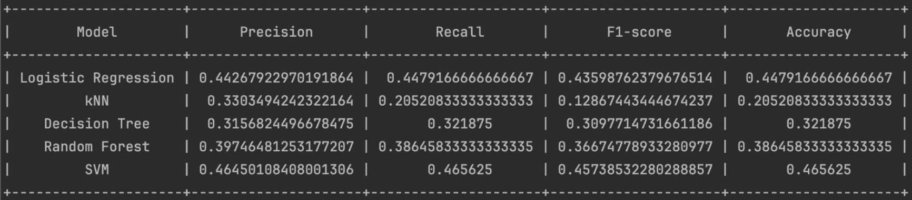

# French Tutor App

The French Tutor App is an interactive tool designed to assist users in improving their French language skills. It offers functionalities such as translating text from French to English, predicting the user's French proficiency level, and providing customized learning tips based on the evaluated difficulty level.

## Installation

To install and run the French Tutor App on your local machine, follow these steps:

### Prerequisites

Make sure you have the following installed:
- Python (version 3.6 or later)
- pip (Python package manager)

### Steps

1. **Clone the Repository**

   ```bash
   git clone https://github.com/nathanvdv/french-tutor-app.git
   cd french-tutor-app
   ```

2. **Set up a Virtual Environment** (Optional but recommended)

   ```bash
   python -m venv venv
   source venv/bin/activate  # On Windows use `venv\Scripts\activate`
   ```

3. **Install Dependencies**

   ```bash
   pip install -r requirements.txt
   ```

4. **Run the Application**

   ```bash
   streamlit run app.py
   ```

## Usage

1. **Start the Application**: Open your terminal, navigate to the project directory, and run `streamlit run app.py`.
   
2. **Input Text**: Enter a French sentence or paragraph in the provided text area.

3. **Translate Text**: Click on the "Translate to English" button to see the English translation of your input text.

4. **Evaluate Language Level**: Click on the "Evaluate my level" button to get an assessment of your French proficiency based on the input text.

5. **Get Learning Tips**: To receive learning tips, select the "Get Learning Tips" checkbox and then click on "Evaluate my level". The tips will be displayed based on the predicted difficulty level of your input text.

   The tips include vocabulary items, orthography tips, essential grammar rules, conjugation patterns, and recommended speaking topics suitable for your proficiency level.

## Contributing

Contributions to the French Tutor App are welcome! If you have suggestions or improvements, feel free to fork the repository and submit a pull request.

## License

This project is licensed under the MIT License - see the LICENSE file for details.

## Contact

Romain Hovius - romain.hovius@unil.ch

Nathan Vandeven - nathan.vandeven@unil.ch

Project Link: https://github.com/nathanvdv/french-tutor-app

## Deliverables
### Model scores without doing any data cleaning
<p align="center">
  
</p>

### Our score progression over time

<p align="center">
  
</p>

