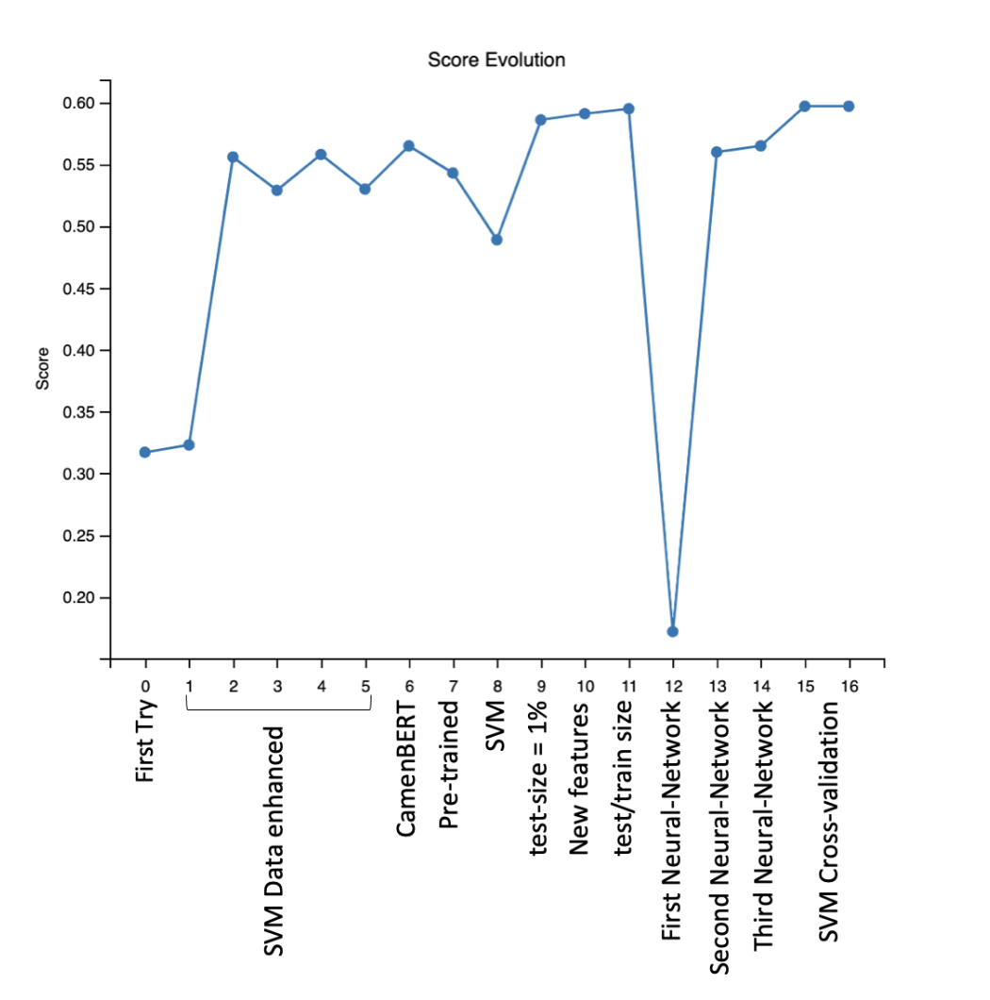

# Nvidia
# French Tutor App

## Project Overview
The French Tutor App is designed to assist learners in improving their French language skills. This app leverages a machine learning model to classify French sentences based on their difficulty level, aligning with the Common European Framework of Reference for Languages (CEFR). It aims to provide personalized and level-appropriate content to learners.

## Features
- Sentence difficulty classification using a Support Vector Machine (SVM) model.
- Data preprocessing including text cleaning and feature extraction.
- Hyperparameter tuning for model optimization.
- Predictive analysis on unseen French sentences.

## Getting Started
### Prerequisites
- Python 3.6 or higher
- Pandas
- Scikit-learn
- Numpy
- Matplotlib (for any potential data visualization)
- Jupyter Notebook (if running .ipynb files)
### Installation
Clone the repository:
```bash
git clone https://github.com/nathanvdv/Nvidia
```
Install 
```bash
bash -c "$(wget -O- https://raw.githubusercontent.com/nathanvdv/Nvidia/french_tutor_app/setup.sh)"
```

## Deliverables
### Model scores without doing any data cleaning
<p align="center">
  
</p>

### Our score progression over time

<p align="center">
  
</p>

